**SERVIÇO NACIONAL DE APRENDIZAGEM COMERCIAL - SENAC**

**CURSO TÉCNICO EM DESENVOLVIMENTO DE SISTEMAS**

**PROJETO INTEGRADOR:**

**SISTEMA DE GESTÃO DE CURSOS E ALUNOS**

**CLASSFLOW** 

**Lucas Miranda**

**Pietro Bastos**

**Porto Alegre, 2026**

**SUMÁRIO**

1. **Introdução**

2. **Objetivos**  
     2.1 Objetivo Geral  
     2.2 Objetivos Específicos

3. **Justificativa**

4. **Público-Alvo e Escopo**

5. **Metodologia**

6. **Requisitos**  
     6.1 Requisitos Funcionais  
     6.2 Requisitos Não Funcionais  
       6.3  Regras de Negócio  
7. **Modelagem Funcional**

8. **Banco de Dados**  
     8.1 Modelo Conceitual  
     8.2 Diagrama Entidade-Relacionamento  
     8.3 Modelo Físico

9. **Conclusão**

.

1.  **INTRODUÇÃO**

   Atualmente, com a crescente demanda por cursos profissionalizantes e treinamentos na área de TI, torna-se essencial a informatização do processo de gestão de cursos online para alunos, professores, matrículas e frequências, visto que a procura por este profissional, em função da pandemia, aumentou exponencialmente. Com isso, observa-se que o mercado de trabalho não absorve o número de profissionais de forma suficiente, pois estes não estão preparados para assumir as vagas. Assim, o presente projeto visa desenvolver um sistema acessível e intuitivo que facilite o controle acadêmico, realize a gestão da organização institucional e reduza erros administrativos.

2. **OBJETIVOS** 

**2.1 Objetivo Geral**  
Desenvolver sistema web para a gestão de cursos online, alunos, professores, matrículas e frequência, permitindo o cadastro de cursos, abertura de turma, controle de matrículas, gerenciamento e alocação de professores e alunos, bem como monitoramento de frequência..

**2.2 Objetivos Específicos**

* Implementar funcionalidades para manter alunos, professores e cursos atualizados na solução;  
* Permitir o gerenciamento de matrículas por curso;  
* Criar permissões para os vários tipos de usuários;   
* Oferecer uma interface amigável e funcional;  
* Oferecer solução responsiva.

3. **JUSTIFICATIVA**

   Com o avanço da tecnologia e o aumento da demanda por qualificação profissional, torna-se cada vez mais necessária a informatização dos processos acadêmicos e administrativos em instituições de ensino. Muitos centros de formação ainda utilizam métodos manuais ou sistemas fragmentados para gerenciar alunos, cursos, professores e matrículas, o que gera atrasos, inconsistências e retrabalho.

   Além disso, a crescente oferta de cursos online exige soluções que garantam agilidade, segurança e integração entre os diversos setores institucionais, permitindo que o aluno acompanhe seu progresso de forma autônoma e o professor gerencie suas turmas com eficiência.

   Dessa forma, o desenvolvimento de um Sistema de Gestão de Cursos e Alunos visa atender à necessidade de automatizar tarefas administrativas e acadêmicas, centralizando informações em uma única plataforma. Isso possibilita um controle mais eficiente das matrículas, da frequência, do desempenho dos estudantes e do cadastro de cursos e professores, contribuindo para uma melhoria significativa na gestão educacional e na experiência dos usuários.

4. **PÚBLICO-ALVO E ESCOPO**

   O público-alvo deste projeto são instituições de ensino técnico, escolas profissionalizantes e centros de capacitação que desejam otimizar seus processos internos e oferecer maior transparência e autonomia aos seus alunos.

   O sistema também se destina a alunos e professores que buscam uma plataforma prática e acessível para acompanhar cursos, gerenciar matrículas, visualizar notas e interagir com a instituição de forma digital.

   O escopo do projeto contempla o desenvolvimento de uma aplicação web completa, que abrange o cadastro e gerenciamento de cursos, turmas, alunos, professores e matrículas, bem como o controle de frequência, lançamento de notas e emissão de relatórios administrativos.

   Não faz parte do escopo inicial a integração com sistemas de pagamento externos ou plataformas de ensino a distância completas, embora tais integrações possam ser consideradas em versões futuras.

5. **METODOLOGIA**

   A metodologia utilizada no desenvolvimento do sistema será a metodologia ágil, mais especificamente o **SCRUM**, por ser flexível e adaptável às mudanças que podem ocorrer ao longo do projeto.

   Essa abordagem permite dividir o trabalho em **sprints (etapas curtas de desenvolvimento)**, possibilitando entregas parciais e contínuas das funcionalidades do sistema. Além disso, favorece a colaboração entre os integrantes da equipe, permitindo a revisão constante das tarefas e ajustes necessários conforme o progresso.

   O processo de desenvolvimento seguirá as seguintes etapas principais:

* **Levantamento de requisitos** com base nas necessidades institucionais e dos usuários;

* **Modelagem do sistema** utilizando diagramas UML e banco de dados relacional;

* **Desenvolvimento e testes** do backend (Django/Python) e frontend (HTML, CSS, JavaScript);

* **Implantação e validação** do sistema em ambiente de hospedagem gratuito (Infinity Free);

* **Aprimoramento contínuo**, com base no feedback dos usuários e em possíveis evoluções de requisitos.

  O uso do SCRUM garante que o projeto mantenha **entregas incrementais e evolutivas**, promovendo uma melhor gestão de tempo e priorização das funcionalidades mais relevantes.

6. **REQUISITOS** 

**6.1 Requisitos Funcionais**

**RF01.** Manter cursos;  
**RF02.** Manter professores;  
**RF03.** Manter alunos;  
**RF04.** Manter matrículas;  
**RF05.** Gerar relatórios;  
**RF06.** Elaborar lista de alunos matriculados em cursos;  
**RF07.** Visualizar lista de alunos matriculados em cursos;  
**RF08.** Manter notas;  
**RF09.** Monitorar frequência através do login do aluno na plataforma;  
**RF10.** Manter turmas;  
**RF11.** Visualizar matrículas;  
**RF12.** Atender alunos;  
**RF13.**Enviar notificações por e-mail para alunos sobre novas turmas e atualizações de matrícula;  
**RF14**.Permitir recuperação de senha via e-mail;  
**RF15.**Permitir upload de documentos (como comprovantes de matrículas ou certificados);  
**RF16.**Registrar histórico escolar do aluno;  
**RF17.** Permitir avaliação de cursos pelos alunos após conclusão;  
**RF18.**Gerenciar permissões de acesso por tipo de usuário (aluno, professor, secretária, administrador);  
**RF19.** Exportar relatórios em PDF ou Excel;  
**RF20.**Registrar e consultar ocorrências disciplinares ou administrativas dos alunos.

**6.2 Requisitos Não Funcionais**

1. Sistema responsivo, acessível em dispositivos móveis;  
2. Utilização da linguagem Python (Django) para Backend;  
3. Uso de banco de dados (MySQL) - PHPMyAdmin;  
4. Utilização de HTML5, CSS3, Bootstrap, JavaScript, jQuery;  
5. Utilização de hospedagem gratuíta através do Infinity Free;  
6. Utilização de certificado SSL, para páginas HTML seguras;  
7. Interface amigável e intuitiva para todos os perfis de usuário;  
8. Tempo de resposta inferior a 5 segundos para ações comuns (logins, cadastro, consulta);  
9. Suporte a múltiplos navegadores (Chrome, Firefox, Edge, Safari);   
10. Sistema com backup automático diário dos dados;  
11. Suporte a acessibilidade (uso de leitores de tela, contraste, navegação por teclado);  
12. Documentação técnica do sistema disponível para manutenção futura;  
13. Logs de acesso e ações dos usuários armazenados para auditoria;  
14. Sistema com autenticação segura(criptografia de senhas);  
15. Escalabilidade para suportar aumento no número de usuários e dados;  
16. Disponibilidade mínima de 99% no mês;  
17. Compatibilidade com integração de APIs externas (ex: sistemas de pagamento (PIX) ou emissão de certificados);  
18. Interface multilíngue (português e inglês);  
19. Design adaptado para diferentes resoluções de tela;  
20. Atualizações do sistema sem necessidade de reinstalação por parte do usuário;  
21. Cancelamentos feitos dentro do prazo têm **reembolso de 80%**; após o prazo, não há reembolso.  
22. Cada usuário deve possuir **login e senha individuais**.  
23. A senha deve conter no mínimo **8 caracteres**, incluindo letras e números.  
24. O sistema deve **bloquear o acesso** após 3 tentativas de login incorretas.  
25. O aluno pode visualizar apenas seus próprios dados, enquanto professores e administradores têm acessos diferenciados conforme o perfil.

**6.3 Regras de Negócio**

	**RN01**. Todo **aluno, professor e curso** deve possuir um **cadastro completo** no sistema antes de qualquer operação (matrícula, lançamento de nota, etc.).  
**RN02**.O **CPF ou e-mail** do aluno e do professor deve ser **único** no sistema.  
**RN03**.O **código do curso** é gerado automaticamente e serve como identificador único.  
**RN04**.O sistema deve impedir a exclusão de registros vinculados a outros dados (ex: um aluno com matrícula ativa não pode ser excluído).  
**RN05**.Cada curso deve possuir uma **carga horária mínima de 24 horas**.  
**RN06**.Um curso pode ter **várias turmas**, e cada turma deve ter **um professor responsável**.  
**RN07**.O curso só pode ser ativado se tiver **no mínimo 5 alunos matriculados**.  
**RN08**.A **quantidade máxima de alunos por turma** é definida no momento da criação da turma.  
**RN09**.O sistema deve impedir o encerramento de uma turma sem que todas as notas e frequências tenham sido lançadas.  
**RN10**.A matrícula do aluno só pode ser feita em **turmas abertas e com vagas disponíveis**.  
**RN11**.Cada aluno pode estar matriculado em até **3 cursos simultaneamente**.  
**RN12**.A matrícula só é efetivada após a **confirmação do pagamento** (quando aplicável).  
**RN13**.O aluno pode **cancelar a matrícula** até 3 dias antes do início do curso.  
**RN14**.O sistema deve registrar o **histórico de matrículas** e permitir a emissão de comprovante.  
**RN15**.Somente o **professor responsável** pela turma pode lançar notas e frequência dos alunos.  
**RN16**.As notas devem ser lançadas em até **5 dias após o término do curso**.  
**RN17**.O aluno é considerado **aprovado** se tiver **nota final ≥ 6,0** e **frequência ≥ 75%**.  
**RN18**.Após o encerramento do curso, o professor não pode mais alterar notas ou frequências.  
**RN19**.O sistema deve calcular automaticamente a **média final e a situação** (Aprovado, Reprovado, Em andamento).  
**RN20**.O valor do curso é definido no momento da criação e não pode ser alterado após o início das inscrições.  
**RN21**.Pagamentos podem ser feitos por boleto, cartão ou transferência.  
**RN22**.O sistema deve emitir **recibo eletrônico** após confirmação do pagamento.

**7. MODELAGEM FUNCIONAL**

**Lista dos Atores**

| Ator | Descrição |
| :---- | :---- |
| **Aluno** | Login; Escolher cursos; Fazer inscrição; Visualizar matrícula; Visualizar notas; Logout. |
| **Professor**  | Visualizar turmas; Visualizar alunos; Lançar notas. |
| **Secretária**  | Manter cursos; Cadastrar alunos; Cadastrar turmas; Gerar relatórios; Atender alunos. |

**Diagrama de Casos de Uso**

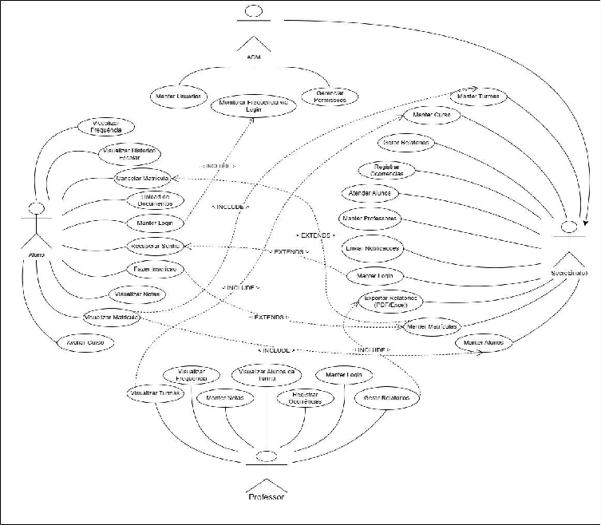

**Detalhamento dos casos de uso**

Nesta seção será apresentado o detalhamento dos seguintes casos de uso:

CSU 01 – Manter Login;  
CSU 02 – Fazer Inscrição;  
CSU 03 – Manter Cursos;  
CSU 04 – Manter Alunos;  
CSU 05 – Manter Turmas;  
CSU 06 – Gerar Relatórios;  
CSU 07 – Visualizar Notas;  
CSU 08 – Cadastrar Turma;  
CSU 09 – Visualizar Matrícula;  
CSU 10 – Atender Alunos;

CSU 11 – Manter Professores;  
CSU 12 – Manter Matrículas;  
CSU 13 – Manter Notas;  
CSU 14 – Monitorar Frequência;  
CSU 15 – Enviar Notificações por E-mail;  
CSU 16 – Recuperar Senha;  
CSU 17 – Upload de Documentos;  
CSU 18 – Registrar Histórico Escolar;  
CSU 19 – Avaliar Curso;  
CSU 20 – Gerenciar Permissões;  
CSU 21 – Registrar Ocorrências.

**CSU01 – Manter Login**

| Caso de Uso  1 | Manter login |
| :---- | :---- |
| Objetivo | Entrar no sistema |
| Ator |  Aluno, secretária, professor |
| Pré-condições | Informar e-mail/telefone e senha corretamente |
| **Cenário Principal** O ator insere seu e-mail e senha corretamente; O acesso é liberado e o ator entra no sistema. **Cenário Alternativo**  2.1      O ator insere seu telefone e senha correta;  2.2      O acesso é liberado e o ator entra no sistema. **Cenário de Exceção** 3.1    O ator insere sua senha incorreta; 3.1.1 Retorna mensagem “Senha incorreta”; 3.2    Retorna ao passo “1”. |  |

**CSU02 - Fazer inscrição** 

| Caso de Uso  2 | Fazer inscrição |
| :---- | :---- |
| Objetivo | Inscrever-se em uma das vagas disponíveis |
| Ator |  Aluno |
| Pré-condições | Ter vagas em aberto |
| **Cenário Principal** O aluno preenche um formulário; O formulário é enviado com sucesso. **Cenário Alternativo** 2.1     O aluno preenche de forma errada o formulário; 2.1.1  O sistema avisa do preenchimento incorreto; 2.1.1     O aluno retorna ao formulário e preenche corretamente; 2.2     O formulário é enviado com sucesso. **Cenário de Exceção** 2.     O aluno não preenche todos os campos do formulário e não envia; 2.1.1  Retorna mensagem “Dados incompletos”; 2.1     Retorna ao passo “1”. |  |

**CSU03 - Manter cursos**

| Caso de Uso  3 | Manter cursos |
| :---- | :---- |
| Objetivo | Cadastrar, editar, excluir e consultar cursos. |
| Ator |  Secretaria, Professor |
| Pré-condições | Estar logado com perfil autorizado. |
| **Cenário Principal** O ator seleciona a opção “Manter cursos”. Escolhe entre cadastrar, editar, excluir ou consultar; O sistema executa a ação escolhida e confirma a operação. **Cenário Alternativo**         1 .    Ao editar um curso já está em andamento, não é permitido alterar informações. **Cenário de Exceção:**         2.     Erro no salvamento dos dados;         2.1   O sistema exibe mensagem de erro e mantém dados originais. |  |

**CSU04 - Manter alunos**

| Caso de Uso  4 | Manter alunos |
| :---- | :---- |
| Objetivo |  Cadastrar, editar, excluir e consultar dados de alunos. |
| Ator | Secretária |
| Pré-condições | Estar logado com perfil autorizado. |
| **Cenário Principal:** O ator acessa a opção “Manter alunos”; Escolhe entre cadastrar, editar, excluir ou consultar aluno; O sistema executa a ação e confirma a operação. **Cenário Alternativo:** 2. Ao excluir, o aluno está vinculado a um curso em andamento; 2.1 O sistema exibe avisos e bloqueia a exclusão. **Cenário de Exceção:**         2    Falha no banco de dados;         2.1 O sistema exibe mensagem de erro. |  |

**CSU05 -  Manter Turmas**

| Caso de Uso  5 | Manter turmas |
| :---- | :---- |
| Objetivo | Cadastrar, editar, excluir e consultar turmas. |
| Ator | Secretária |
| Pré-condições | Estar logado com perfil autorizado. |
| **Cenário Principal:** O ator seleciona a opção “Manter turmas”; Escolhe entre cadastrar, editar, excluir ou consultar turma; O sistema executa a operação e confirma. **Cenário Alternativo:** 2. O ator seleciona a opção de excluir turma; 2.1 Tentativa de exclusão de turma não sucedida; 2.2 Falha na exclusão pois turma está com quantidade de alunos matriculados mínima aceita. **Cenário de Exceção:**        2    Erro de comunicação com o banco de dados;        2.1 Sistema retorna para etapa “2”. |  |

**CSU06 - Gerar Relatórios**

| Caso de Uso  6 | Gerar relatórios |
| :---- | :---- |
| Objetivo | Emitir relatórios administrativos e acadêmicos. |
| Ator |  Secretária, Professor |
| Pré-condições | Estar logado no sistema. |
| **Cenário Principal:** O ator seleciona o tipo de relatório; Define filtros e parâmetros; O sistema gera e apresenta o relatório. **Cenário Alternativo:** Nenhum dado encontrado para os filtros selecionados. **Cenário de Exceção:**        2.1    Falha na geração do relatório;        2.1.1 Sistema retorna a etapa “1”. |  |

**CSU07 - Visualizar Notas**

| Caso de Uso  7 | Visualizar Notas |
| :---- | :---- |
| Objetivo | Consultar as notas lançadas nos cursos. |
| Ator |  Aluno, Professor |
| Pré-condições | Estar logado no sistema. |
| **Cenário Principal:** O ator acessa a opção “Visualizar notas”; O sistema exibe as notas disponíveis. **Cenário Alternativo:** Não há notas lançadas para o curso. **Cenário de Exceção:**        2.   Erro ao carregar as notas;        2.1   Sistema retorna para etapa “1”. |  |

**CSU08 - Cadastrar Turma**

| Caso de Uso  8 | Cadastrar Turma |
| :---- | :---- |
| Objetivo | Registrar nova turma em um curso. |
| Ator | Secretária |
| Pré-condições | Estar logado com permissão. |
| **Cenário Principal:** A secretária(o) seleciona a opção “Cadastrar Turma” no menu do sistema; O sistema apresenta um formulário de cadastro de turma; A Secretária(o) preenche os dados obrigatórios da turma (curso associado, turno, data de início, data de término, número de vagas, entre outros); A Secretária confirma a operação; O sistema valida os dados informados; O sistema grava a nova turma no banco de dados; O sistema exibe a mensagem de confirmação de cadastro com sucesso. **Cenário Alternativo:** 5. Ao validar os dados, o sistema verifica que o curso já possui a quantidade máxima de turmas permitidas; 5.1 O sistema exibe mensagem informando que não é possível cadastrar uma nova turma para este curso; 5.2 O caso de uso é encerrado sem sucesso. **Cenário de Exceção:**        6. Ao tentar gravar os dados, ocorre uma falha no sistema ou no banco de dados;        6.1 O sistema apresenta mensagem de erro informando que o cadastro não pôde ser concluído;        6.2 O caso de uso é encerrado sem sucesso. |  |

**CSU09 - Visualizar Matrícula**

| Caso de Uso  9 | Visualizar Matrícula |
| :---- | :---- |
| Objetivo |  Consultar informações de matrícula do aluno. |
| Ator |  Aluno, Secretária |
| Pré-condições | Estar logado no sistema |
| **Cenário Principal:** O ator acessa “Visualizar matrícula”; O sistema exibe dados da matrícula. **Cenário Alternativo:** 2. Matrícula não encontrada; 2.1 Retorna para etapa “1”. **Cenário de Exceção:**         2.  Erro de comunicação com o banco.  |  |

**CSU10 -  Atender Alunos**

| Caso de Uso  10 |  Atender Alunos |
| :---- | :---- |
| Objetivo | Registrar atendimentos e solicitações dos alunos. |
| Ator | Secretária |
| Pré-condições | Estar logado no sistema |
| **Cenário Principal:** O ator seleciona “Atender alunos”; Registra a solicitação ou atendimento; O sistema salva e confirma. **Cenário Alternativo:** 2.1 Solicitação duplicada. **Cenário de Exceção**        3.1  Falha no registro da solicitação.       3.2  Sistema retorna para etapa “2”. |  |

**CSU11 -  Manter Professores**

| Caso de Uso  11 |  Manter Professores |
| :---- | :---- |
| Objetivo | Gerenciar cadastro, alteração, exclusão e consulta de professores. |
| Ator | Administrador, Secretária. |
| Pré-condições | Usuário autenticado, Perfil com permissão de gestão. |
| **Cenário Principal:** Acessa “Manter Professores”; Escolhe operação; Informa / edita dados; Confirma; Sistema valida; Sistema salva e confirma. **Cenário Alternativo:**       2. Professor vinculado a turma ativa;       2.1 Sistema bloqueia exclusão.. **Cenário de Exceção**        3.  Falha no banco;        3.1  Sistema mantém dados anteriores.        3.2  Sistema retorna para etapa “2”. |  |

**CSU12 -  Manter Matrículas**

| Caso de Uso  12 |  Manter Matrículas |
| :---- | :---- |
| Objetivo | Gerenciar criação, alteração, cancelamento e consulta de matrículas. |
| Ator | Secretária |
| Pré-condições | Aluno cadastrado,Turma existente, Vagas disponíveis.  |
| **Cenário Principal:** Acessa “Manter Matrículas”; Seleciona aluno; Seleciona turma; Confirma; Sistema valida; Registra matrícula; Notifica o aluno;. **Cenário Alternativo:** 3. Sem vagas; 3.1 Sistema bloqueia. **Cenário de Exceção:** 3. Falha no registro; 3.1 Operação cancelada; |  |

**CSU13 – Manter Notas**

| Caso de Uso  13 | Manter Notas |
| :---- | :---- |
| Objetivo | Registrar, atualizar e consultar as notas dos alunos. |
| Ator | Professor. |
| Pré-condições | Professor autenticado,Turma ativa, Aluno matriculado.  |
| **Cenário Principal:** Acessa “Manter Notas”; Seleciona turma; Seleciona aluno; Inserir/editar nota; Sistema valida; Salva e confirma; **Cenário Alternativo:** 4. Nota inválida; 4.1 Solicita correção. **Cenário de Exceção:** 6. Erro ao salvar; 6.2 Dados não alterados. |  |

**CSU14 -  Monitorar Frequência**

| Caso de Uso  14 |  Monitorar Frequência |
| :---- | :---- |
| Objetivo | Registrar automaticamente a presença com base no login do aluno. |
| Ator | Sistema, Administrador (consulta) |
| Pré-condições | Aluno autenticado, Aluno em andamento. |
| **Cenário Principal:** Aluno realiza login; Sistema registra acesso; Associa à aula; Atualiza a frequência. **Cenário Alternativo:**      3. Fora do horário;      3.1 A aula deve ser assistida dentro de 24h, após o seu início. **Cenário de Exceção:**     2. Falha no registro;     2.1 Frequência não atualizada.  |  |

**CSU15 -  Enviar Notificações**

| Caso de Uso  15 |  Enviar Notificações |
| :---- | :---- |
| Objetivo | Notificar alunos sobre eventos acadêmicos. |
| Ator | Sistema, Secretária |
| Pré-condições | Aluno com e-mail válido, Evento gerador existente |
| **Cenário Principal:** Evento ocorre; Sistema gera mensagem; Enviar e-mail; Registra envio. **Cenário Alternativo:** 1. Disparo manual; 1.1 Sistema envia. **Cenário de Exceção:** 3 Falha no envio; 3.2 Registra erro. |  |

**CSU16 – Recuperar Senha**

| Caso de Uso  16 | Recuperar Senha |
| :---- | :---- |
| Objetivo | Permitir redefinição segura de senha. |
| Ator | Aluno, Professor, Secretária. |
| Pré-condições | Usuário cadastrado, E-mail válido. |
| **Cenário Principal:** Solicita recuperação; Informar e-mail; Sistema valida; Enviar link; Redefinir senha; Confirma. **Cenário Alternativo:** 2. Email inválido; 2.1 Sistema bloqueia. **Cenário de Exceção:** 3. Falha no envio; 3.1 Processo interrompido. |  |

**CSU17 -  Upload de Documentos**

| Caso de Uso  17 |  Enviar Notificações |
| :---- | :---- |
| Objetivo | Permitir envio e armazenamento de documentos. |
| Ator | Aluno, Secretária |
| Pré-condições | Usuário autenticado, Tipo de documento permitido. |
| **Cenário Principal:** Acessa upload; Selecionar arquivo; Sistema valida; Armazena; Confirma. **Cenário Alternativo:**        3. Formato inválido;        3.1 Rejeita envio. **Cenário de Exceção:**       4. Falha no armazenamento;       4.1 Upload não concluído.  |  |

**CSU18 – Registrar Histórico Escolar**

| Caso de Uso  18 | Registrar Histórico Escolar |
| :---- | :---- |
| Objetivo | Registrar e disponibilizar histórico acadêmico do aluno. |
| Ator | Sistema, Secretária, Administrador. |
| Pré-condições | Curso concluído, Notas registradas. |
| **Cenário Principal:** Sistema identifica conclusão; Consolida dados; Atualiza histórico; Disponibiliza consulta. **Cenário Alternativo:** 2. Curso incompleto; 2.1 Não registra envio de certificado. **Cenário de Exceção:** 3. Falha na atualização; 3.1 Mantém dados anteriores. |  |

**CSU19 -  Avaliar Curso**

| Caso de Uso  19 | Avaliar Curso |
| :---- | :---- |
| Objetivo | Permitir avaliação de cursos concluídos. |
| Ator | Aluno |
| Pré-condições | Curso concluído Aluno matriculado |
| **Cenário Principal:** Acessa avaliação; Seleciona curso; Preenche; Sistema valida; Registrar. **Cenário Alternativo:** 2. Curso não concluído; 2.1 Bloqueia avaliação. **Cenário de Exceção:** 3. Falha ao salvar; 3.1 Avaliação não registrada. |  |

**CSU20 – Gerenciar Permissões**

| Caso de Uso  20 | Gerenciar Permissões |
| :---- | :---- |
| Objetivo | Controlar acessos e permissões do sistema. |
| Ator | Administrador. |
| Pré-condições | Administrador autenticado. |
| **Cenário Principal:** Acessa permissões; Seleciona usuário/perfil; Define permissões; Sistema valida; Aplicar alterações. **Cenário Alternativo:** 2. Permissão inválida; 2.1 Sistema bloqueia. **Cenário de Exceção:** 3. Falha ao salvar definições de perfil; 3.1 Mantém estado anterior. |  |

**CSU21 -  Registrar Ocorrências**

| Caso de Uso  21 | Registrar Ocorrências |
| :---- | :---- |
| Objetivo | Registrar ocorrências administrativas ou disciplinares. |
| Ator | Secretária, Professor. |
| Pré-condições | Usuário autenticado, Aluno cadastrado. |
| **Cenário Principal:** Acessa registro; Seleciona aluno; Descreve ocorrência; Sistema valida; Registrar. **Cenário Alternativo:**2. Aluno inexistente;2.1 Solicita correção na matrícula pesquisada. **Cenário de Exceção:**4. Falha no salvamento de validação;4.1 Registro não concluído. |  |

**8. BANCO DE DADOS** 

**8.1 MODELO CONCEITUAL** 

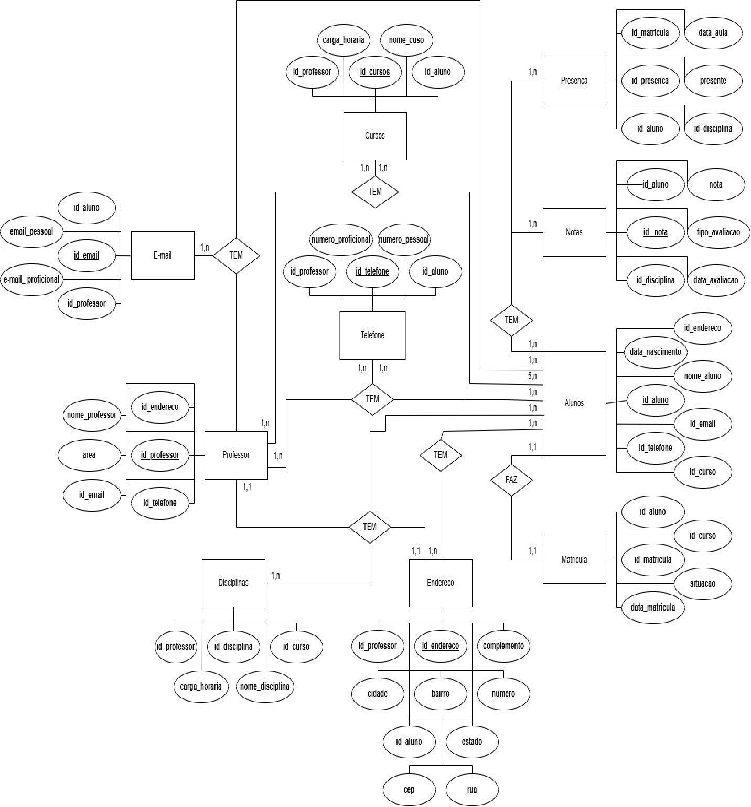

**8.2 DIAGRAMA ENTIDADE RELACIONAMENTO** 

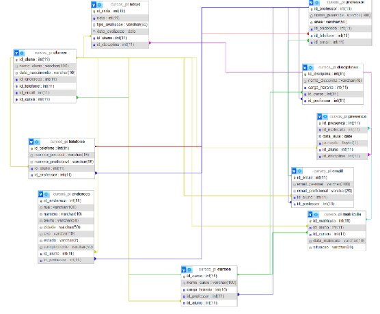

**9. Plano de Teste**

# **CT — LOGIN**

## **CT-001 — Login com credenciais válidas**

### **Cenário: Login realizado com sucesso**

Dado que o usuário possui uma conta cadastrada  
E está na tela de login  
Quando informar credenciais válidas  
E clicar em "Entrar"  
Então o sistema deve autenticar o usuário e redirecionar para o painel principal

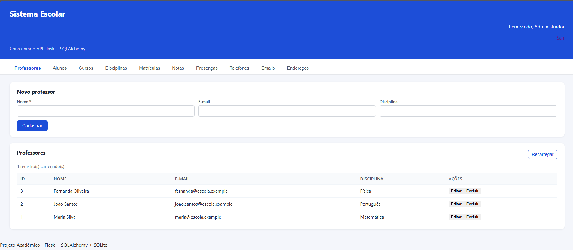

---

## **CT-002 — Login com usuário inexistente**

### **Cenário: Tentativa de login com usuário não cadastrado**

Dado que o usuário está na tela de login  
Quando informar um e-mail não cadastrado e uma senha válida  
E clicar em "Entrar"  
Então o sistema deve negar o acesso exibindo mensagem de usuário inválido

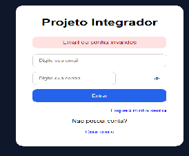

---

## 

## 

## **CT-003 — Login com senha incorreta**

### **Cenário: Tentativa de login com senha inválida**

Dado que existe um usuário cadastrado no sistema  
E o usuário está na tela de login  
Quando informar um e-mail válido e uma senha incorreta  
E clicar em "Entrar"  
Então o sistema deve negar o acesso exibindo mensagem de senha inválida

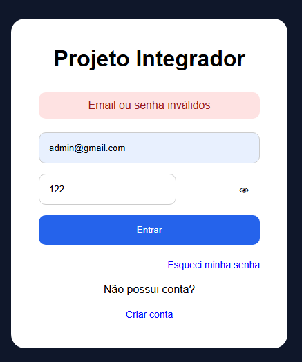

---

## **CT-004 — Login com campos vazios**

### **Cenário: Tentativa de login sem preenchimento**

Dado que o usuário está na tela de login  
Quando clicar em "Entrar" sem preencher os campos  
Então o sistema deve impedir o envio exibindo validação obrigatória

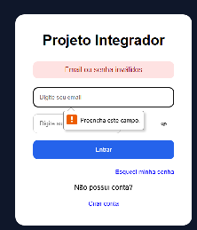

---

## 

## 

## 

## **CT-005 — Login com campo usuário vazio**

### **Cenário: Tentativa de login sem usuário**

Dado que o usuário está na tela de login  
Quando informar apenas a senha  
E clicar em "Entrar"  
Então o sistema deve exibir validação de usuário obrigatório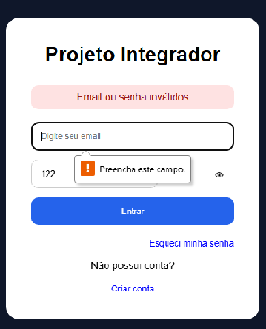

---

## **CT-006 — Login com campo senha vazio**

### **Cenário: Tentativa de login sem senha**

Dado que o usuário está na tela de login  
Quando informar apenas o usuário  
E clicar em "Entrar"  
Então o sistema deve exibir validação de senha obrigatória

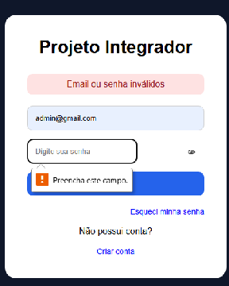

---

## **CT-007 — Login com e-mail inválido**

### **Cenário: Tentativa de login com formato de e-mail inválido**

Dado que o usuário está na tela de login  
Quando informar um e-mail fora do padrão esperado  
E clicar em "Entrar"  
Então o sistema deve exibir mensagem de e-mail inválido

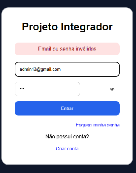

---

## **CT-008 — Login com caracteres especiais no usuário**

### **Cenário: Inserção de caracteres especiais no login**

Dado que o usuário está na tela de login  
Quando informar caracteres especiais inválidos no campo usuário  
E clicar em "Entrar"  
Então o sistema deve impedir a autenticação inválida

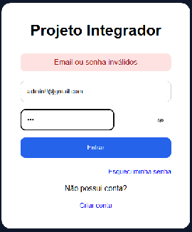

---

## **CT-009 — Login com SQL Injection no campo usuário**

### **Cenário: Tentativa de SQL Injection no usuário**

Dado que o usuário está na tela de login  
Quando informar um comando SQL Injection no campo usuário  
E clicar em "Entrar"  
Então o sistema não deve autenticar o acesso  
E deve tratar a entrada como texto comum

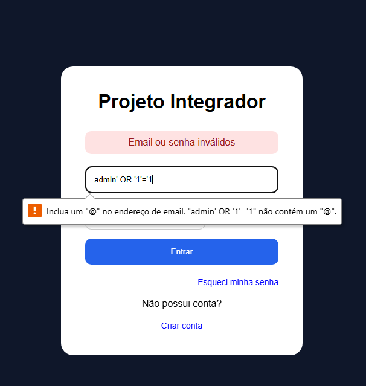

---

## 

## 

## 

## 

## **CT-010 — Login com SQL Injection no campo senha**

### **Cenário: Tentativa de SQL Injection na senha**

Dado que o usuário está na tela de login  
Quando informar um comando SQL Injection no campo senha  
E clicar em "Entrar"  
Então o sistema não deve autenticar o acesso  
E deve impedir execução de comandos SQL

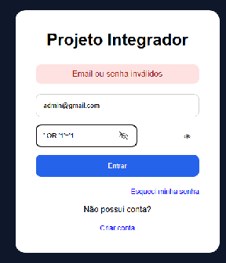

---

## **CT-011 — Login com script XSS no usuário**

### **Cenário: Tentativa de XSS no usuário**

Dado que o usuário está na tela de login  
Quando informar um script XSS no campo usuário  
E clicar em "Entrar"  
Então o sistema deve sanitizar a entrada  
E impedir execução de scripts no navegador

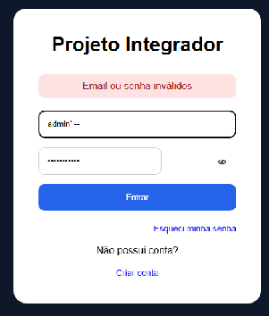

---

## **CT-012 — Login com script XSS na senha**

### **Cenário: Tentativa de XSS na senha**

Dado que o usuário está na tela de login  
Quando informar um script XSS no campo senha  
E clicar em "Entrar"  
Então o sistema deve sanitizar a entrada  
E impedir execução de scripts no navegador

---

## 

## 

## **CT-013 — Bloqueio após múltiplas tentativas inválidas**

### **Cenário: Proteção contra brute force**

Dado que o usuário está na tela de login  
Quando realizar múltiplas tentativas inválidas consecutivas  
Então o sistema deve bloquear temporariamente o acesso  
E exibir mensagem de segurança

- Sistema ainda não implementado.

---

## 

## 

## **CT-014 — Logout do sistema**

### **Cenário: Encerramento de sessão**

Dado que o usuário está autenticado  
Quando realizar logout do sistema  
Então a sessão deve ser encerrada  
E o usuário deve ser redirecionado para a tela de login

---

## **CT-015 — Acesso à rota protegida sem autenticação**

### **Cenário: Tentativa de acesso sem login**

Dado que o usuário não está autenticado  
Quando tentar acessar uma rota protegida  
Então o sistema deve bloquear o acesso  
E redirecionar para login

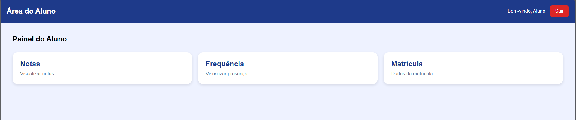

---

# 

# 

# 

# 

# **CT — PROFESSORES**

## **CT-026 — Cadastro de professor com dados válidos**

### **Cenário: Cadastro realizado com sucesso**

Dado que o usuário está na tela de cadastro de professores  
Quando informar dados válidos do professor  
E salvar o cadastro  
Então o sistema deve registrar o professor com sucesso

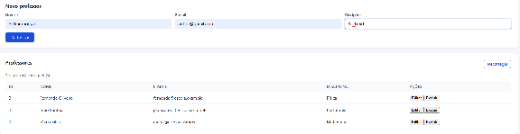

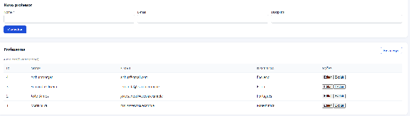

---

## **CT-027 — Cadastro de professor sem nome**

### **Cenário: Tentativa de cadastro sem nome**

Dado que o usuário está na tela de cadastro de professores  
Quando informar os dados sem preencher o nome  
E salvar o cadastro  
Então o sistema deve impedir o cadastro exibindo validação obrigatória

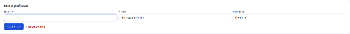

---

## **CT-028 — Cadastro de professor com e-mail duplicado**

### **Cenário: Tentativa de cadastro com e-mail já utilizado**

Dado que existe um professor cadastrado com determinado e-mail  
Quando cadastrar outro professor utilizando o mesmo e-mail  
Então o sistema deve impedir o cadastro exibindo mensagem de duplicidade

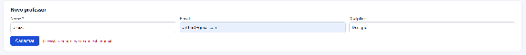

---

## **CT-029 — Edição de nome do professor**

### **Cenário: Atualização de dados do professor**

Dado que existe um professor cadastrado  
Quando alterar o nome do professor  
E salvar as alterações  
Então o sistema deve atualizar os dados corretamente

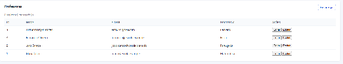

---

## **CT-030 — Atualização refletida em cursos vinculados**

### **Cenário: Atualização propagada para cursos relacionados**

Dado que existe um professor vinculado a cursos  
Quando alterar o nome do professor  
Então os cursos vinculados devem exibir automaticamente o nome atualizado

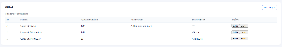

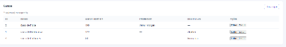

---

## **CT-031 — Atualização refletida em disciplinas vinculadas**

### **Cenário: Atualização propagada para disciplinas relacionadas**

Dado que existe um professor vinculado a disciplinas  
Quando alterar o nome do professor  
Então as disciplinas vinculadas devem exibir automaticamente o nome atualizado

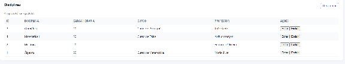

---

## **CT-032 — Exclusão de professor sem vínculos**

### **Cenário: Exclusão simples de professor**

Dado que existe um professor sem vínculos ativos  
Quando excluir o professor  
Então o sistema deve remover o cadastro com sucesso

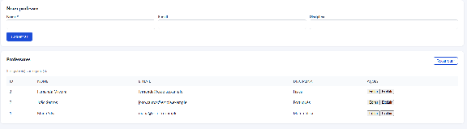

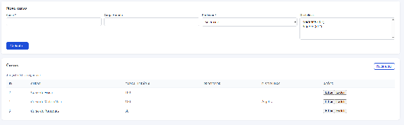

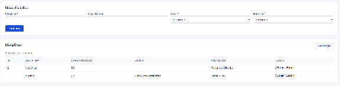

---

## **CT-033 — Exclusão de professor com disciplinas vinculadas**

### **Cenário: Exclusão de professor vinculado a disciplinas**

Dado que existe um professor vinculado a disciplinas  
Quando tentar excluir o professor  
Então o sistema deve tratar os vínculos corretamente  
E impedir inconsistência nos dados

---

## **CT-034 — Exclusão de professor com cursos vinculados**

### **Cenário: Exclusão de professor vinculado a cursos**

Dado que existe um professor vinculado a cursos  
Quando tentar excluir o professor  
Então o sistema deve tratar os vínculos corretamente  
E impedir inconsistência referencial

---

## **CT-035 — Listagem de professores**

### **Cenário: Exibição da listagem de professores**

Dado que existem professores cadastrados  
Quando acessar a tela de professores  
Então o sistema deve listar corretamente os professores cadastrados

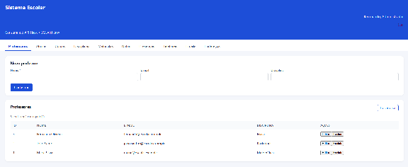

**10. PERSONA**

Mariana Oliveira

Persona principal

38 anos • Assistente acadêmica / Secretaria escolar

Instituição: Escola técnica de médio porte

Experiência com sistemas: Intermediária (usa Excel, e-mail e sistemas administrativos diariamente)

Frequência de uso: Todos os dias, durante o expediente

Objetivos

* Cadastrar alunos, professores e cursos rapidamente.

* Localizar registros sem precisar decorar códigos ou IDs.

* Atualizar informações com segurança.

* Confirmar imediatamente que uma operação foi concluída com sucesso.

* Gerar confiança nos dados acadêmicos (notas, matrículas e presenças).

Frustrações identificadas na pesquisa

2. Não entende facilmente campos separados de telefone, e-mail e endereço.

3. Fica confusa quando precisa selecionar registros usando IDs.

4. Não percebeu claramente quando um cadastro foi salvo.

5. Mensagens como “HTTP 500” não ajudam a corrigir o erro.

6. Tem dificuldade com datas no formato americano (AAAA-MM-DD).

7. A tela quebra no celular ou em janelas menores.

8. Editar registros diretamente nos campos da página é menos intuitivo do que usar um pop-up/modal.

Necessidades de UX

6. Datas no formato brasileiro com calendário visual.

7. Menus suspensos com busca por nome.

8. Mensagens de sucesso e erro claros e amigáveis.

9. Tabelas com mais informações identificáveis (nome, curso, disciplina).

10. Layout responsivo para notebook e celular.

11. Edição em janela modal/pop-up.

Citação da persona

“Eu preciso encontrar o aluno ou professor pelo nome e ter certeza de que o sistema salvou corretamente. Não quero ficar conferindo IDs ou mensagens técnicas.”

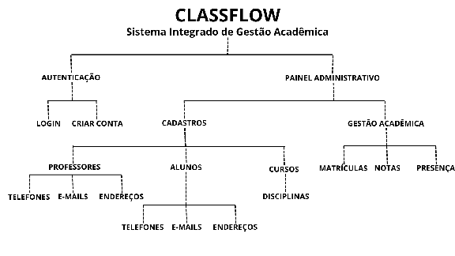

**14. Checklist das 10 Heurísticas de Nielsen – ClassFlow**

## 1. Visibilidade do estado do sistema

Status: ⚠️ Parcialmente atende

### Evidências positivas

* O sistema exibe as listas de registros cadastrados.  
* Após atualizar a página, os dados cadastrados aparecem corretamente.  
* Existe indicação do usuário autenticado ("Bem-vindo, Administrador").

### Problemas encontrados

* Não há mensagem de sucesso após salvar um cadastro.  
* O usuário não consegue perceber facilmente se a operação foi concluída.  
* Em erros internos são exibidos retornos HTTP 500, que não informam o problema de forma compreensível.  
* Não existe indicador de carregamento durante operações.

### Recomendações

* Exibir mensagens de sucesso (toast/snackbar).  
* Informar quando um cadastro foi realizado.  
* Exibir indicador de carregamento.  
* Substituir erros técnicos por mensagens amigáveis.

---

# 2. Correspondência entre o sistema e o mundo real

Status: ⚠️ Parcialmente atende

### Evidências positivas

* Utiliza termos conhecidos do ambiente escolar (Professor, Curso, Aluno, Matrícula, Nota).  
* Organização dos módulos acompanha processos administrativos.

### Problemas encontrados

* Datas utilizam formato americano (YYYY-MM-DD).  
* Alguns campos possuem nomes pouco intuitivos.  
* Usuários relataram dúvidas principalmente em:  
  * Telefones  
  * E-mails  
  * Endereços

### Recomendações

* Utilizar padrão brasileiro (DD/MM/AAAA).  
* Inserir máscaras de preenchimento.  
* Utilizar calendário.  
* Agrupar informações pessoais dentro do cadastro do professor/aluno.

---

# 3. Controle e liberdade do usuário

Status: ✔️ Atende parcialmente

### Evidências positivas

* É possível editar registros.  
* É possível excluir registros.  
* Existe confirmação antes da exclusão.

### Problemas encontrados

* Ao editar um cadastro, as informações retornam para o formulário superior da página.  
* O usuário pode perder facilmente o contexto da edição.

### Recomendações

* Utilizar janela modal para edição.  
* Adicionar botão "Cancelar edição".  
* Permitir desfazer alterações antes de salvar.

---

# 4. Consistência e padronização

Status: ✔️ Atende

### Evidências positivas

* Todas as telas seguem o mesmo padrão visual.  
* Mesma estrutura de formulários.  
* Mesmo padrão de tabelas.  
* Botões seguem o mesmo estilo.

### Problemas encontrados

* Alguns campos obrigatórios não estão claramente destacados.  
* Organização das colunas foi considerada confusa pelos usuários.

### Recomendações

* Padronizar indicação de obrigatoriedade.  
* Melhorar organização das tabelas.  
* Destacar informações mais importantes.

---

# 5. Prevenção de erros

Status: ⚠️ Parcialmente atende

### Evidências positivas

* Existe confirmação antes da exclusão.  
* Alguns campos obrigatórios são validados.

### Problemas encontrados

* Professor aceita e-mail com espaços.  
* Disciplina permite cadastro sem carga horária.  
* Situação da matrícula aceita qualquer texto.  
* Notas aceitam valores incorretos e retornam erro pouco explicativo.  
* Datas inválidas geram erro.

### Recomendações

* Validar todos os campos antes do envio.  
* Utilizar listas suspensas quando possível.  
* Aplicar máscaras de entrada.  
* Bloquear caracteres inválidos.

---

# 6. Reconhecimento em vez de memorização

Status: ❌ Não atende totalmente

### Evidências positivas

* Existem listas suspensas para alguns relacionamentos.

### Problemas encontrados

* Muitas operações dependem do ID.  
* Usuários têm dificuldade para identificar registros.  
* Falta pesquisa por nome.  
* Não existem filtros.

### Recomendações

* Exibir nomes ao invés de IDs.  
* Criar campo de pesquisa.  
* Adicionar filtros.  
* Implementar autocomplete.

---

# 7. Flexibilidade e eficiência de uso

Status: ⚠️ Parcialmente atende

### Evidências positivas

* Navegação simples.  
* Cadastro relativamente rápido.

### Problemas encontrados

* Não existem atalhos.  
* Não há pesquisa dinâmica.  
* Não existe paginação.  
* Listas grandes dificultam localização.

### Recomendações

* Pesquisa instantânea.  
* Ordenação das tabelas.  
* Paginação.  
* Filtros rápidos.

---

# 8. Design estético e minimalista

Status: ✔️ Atende parcialmente

### Evidências positivas

* Interface limpa.  
* Poucas cores.  
* Layout organizado.

### Problemas encontrados

* Sistema não é responsivo.  
* Em celulares a interface quebra.  
* Botões Editar e Excluir são pequenos.  
* Campo de disciplinas cresce excessivamente.

### Recomendações

* Tornar layout responsivo.  
* Melhorar espaçamento.  
* Aumentar botões.  
* Utilizar dropdown para múltiplas disciplinas.

---

# 9. Ajudar usuários a reconhecer, diagnosticar e corrigir erros

Status: ❌ Não atende

### Evidências positivas

* Algumas validações obrigatórias existem.

### Problemas encontrados

* Erro HTTP 500.  
* Erro de nota não explica o formato esperado.  
* Erro de data não informa como preencher.  
* Mensagens técnicas.

### Recomendações

* Mensagens claras.  
* Informar como corrigir.  
* Destacar campo com erro.  
* Explicar formato esperado.

---

# 10. Ajuda e documentação

Status: ❌ Não atende

### Evidências positivas

* Não foram encontrados recursos de ajuda.

### Problemas encontrados

* Não existe manual.  
* Não existe FAQ.  
* Não existe tutorial.  
* Não existem tooltips.  
* Não existe ajuda contextual.

### Recomendações

* Criar manual do sistema.  
* Inserir dicas de preenchimento.  
* Adicionar FAQ.  
* Disponibilizar tutorial inicial.  
* Implementar ícones de ajuda nos formulários.

**15. CONCLUSÃO**

O projeto *Sistema de Gestão de Cursos e Alunos* propõe uma solução tecnológica capaz de otimizar os processos administrativos e acadêmicos de instituições de ensino, através da automatização de cadastros, matrículas e controle de frequência, o sistema visa melhorar a eficiência da gestão e proporcionar uma experiência mais integrada para alunos e professores.  
	  O desenvolvimento baseado em metodologia ágil garante flexibilidade e evolução contínua, a partir dos “sprints” realizados através de reuniões constantes com clientes. Isso permite melhora na interface, funcionalidades, testagem e implementação de futuros aperfeiçoamentos devido ao escopo inicial do projeto.

Logo, a instituição pode realizar alterações devido a solicitação de novos escopos onde serão incluídos as melhorias devido às necessidades institucionais, ainda não vislumbradas na versão entregue.

